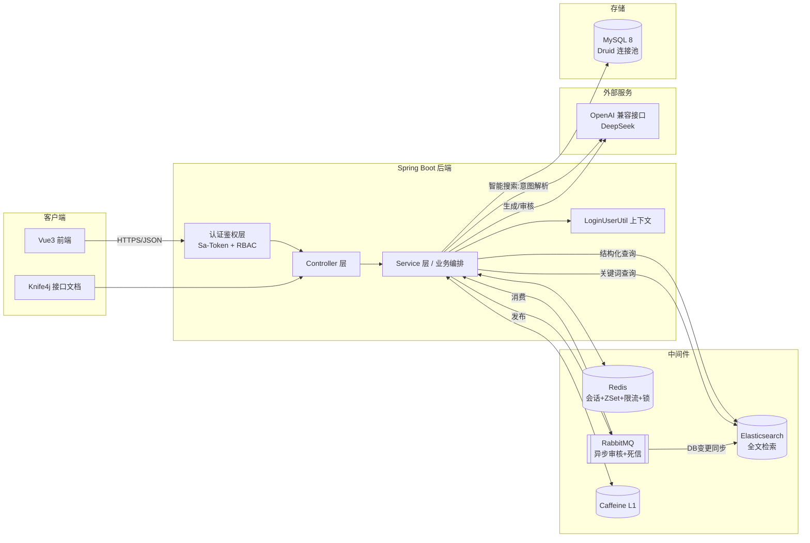
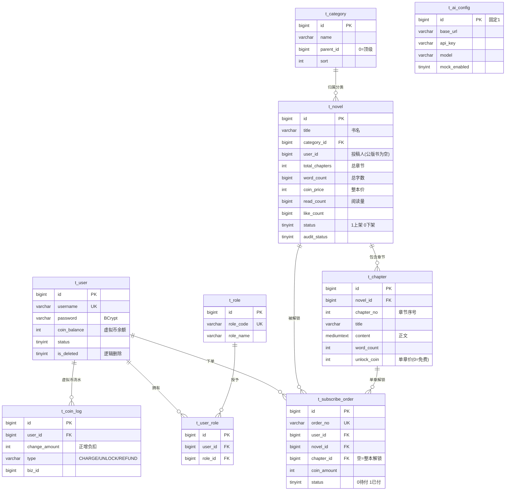
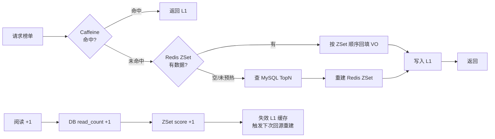
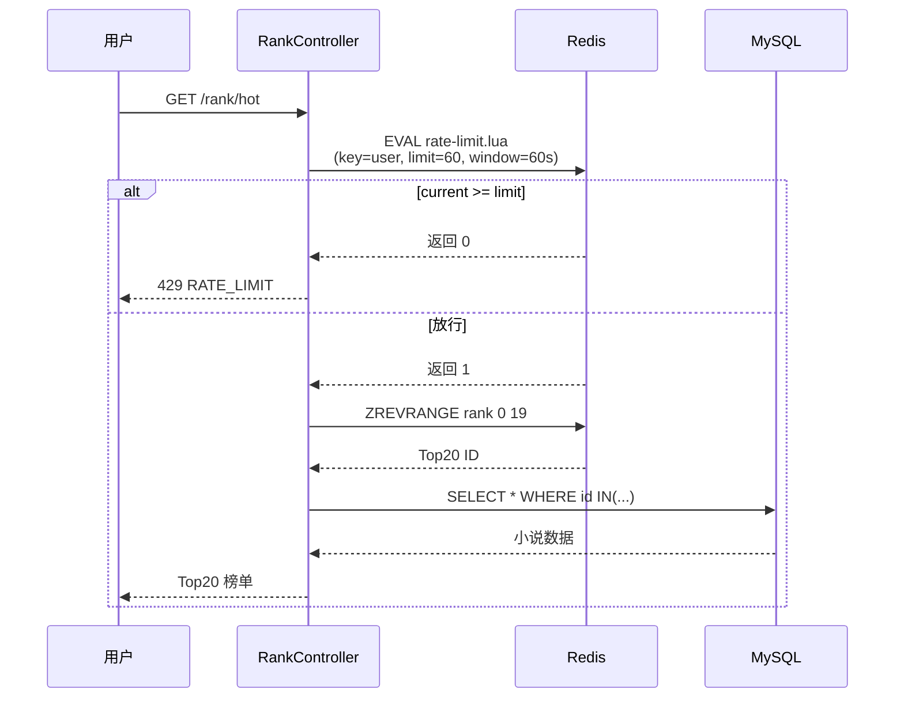
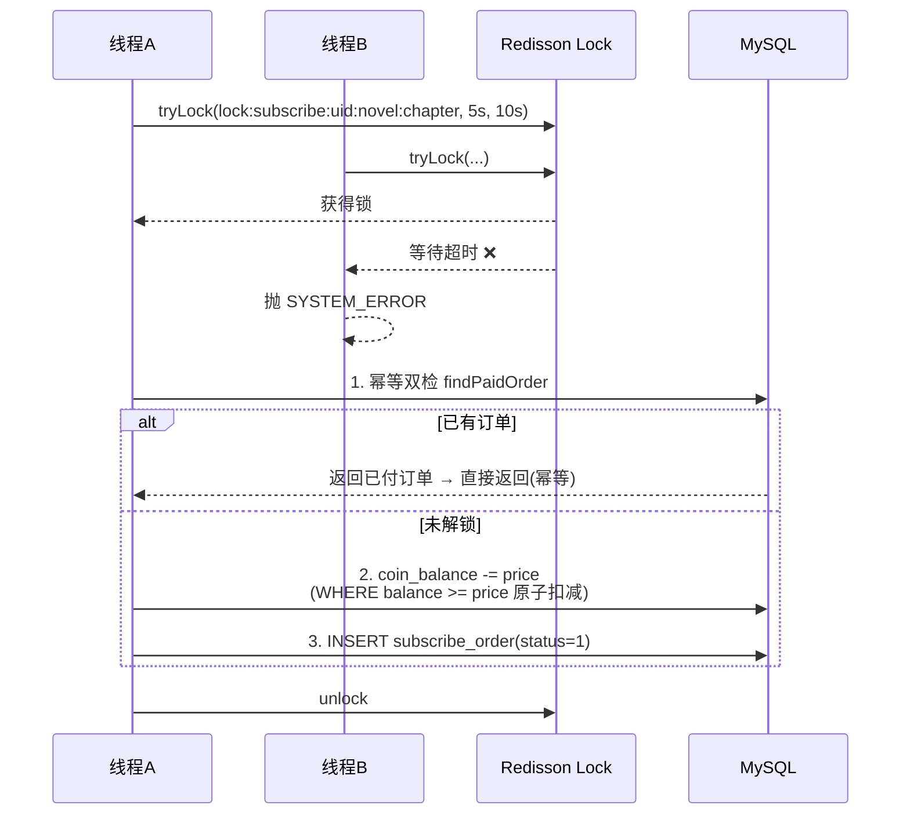
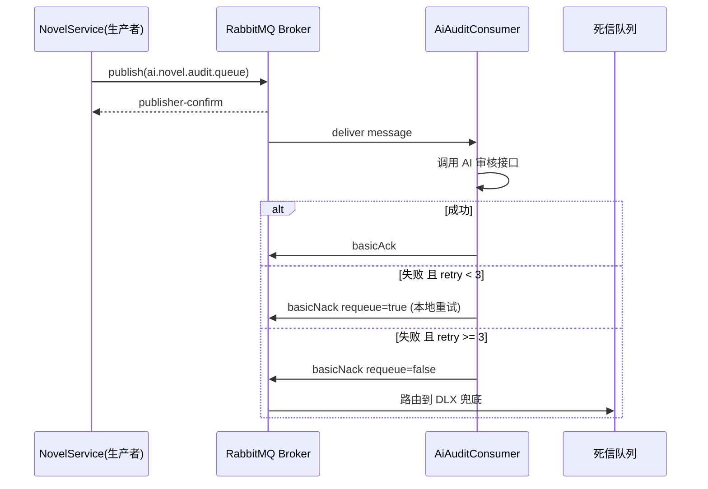
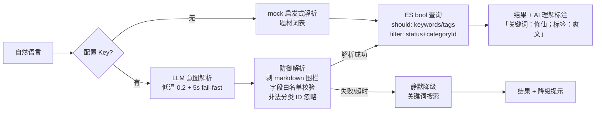
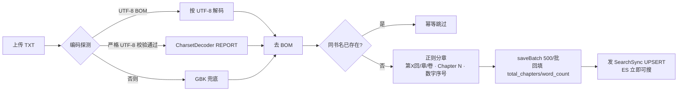

# 灵阅 · AI 小说阅读平台

[](https://github.com/borgejackson5-ctrl/ai-project/actions/workflows/ci.yml)


> **仓库**：[Gitee 主仓](https://gitee.com/foreverck/ai-project) · [GitHub 镜像](https://github.com/borgejackson5-ctrl/ai-project)

一个基于 **Spring Boot 3 + Vue 3** 的前后端分离小说阅读与创作平台：以**内容分发与虚拟币交易链路**（发布审核 / 充值 / 章节解锁 / 订单）为业务核心，以 **AI 能力**（智能搜索 / 书名简介生成 / AI 审核）为增值亮点，叠加 **Elasticsearch 全文检索**、**三级缓存榜单**、**分布式锁防超扣**、**公版书文本导入器** 等后端深度技术点。

> 内容说明：站内书籍来自**公版书**（古典名著，如西游记/聊斋），由后端导入脚本入库，合法免费、可读、可搜索；用户亦可投稿原创小说，经 AI 预审 + 管理员终审后上架。

---

## 核心功能

| 模块           | 功能                                       | 技术亮点                                          |
| -------------- | ------------------------------------------ | ------------------------------------------------- |
| 认证鉴权       | 登录 / 登出 / 用户信息                     | Sa-Token + Redis 共享会话 + RBAC 注解鉴权         |
| 小说管理       | 分页查询 / 详情 / 上下架 / 阅读点赞         | MyBatis-Plus + 逻辑删除 + 原子自增                |
| 章节阅读       | 目录列表 / 正文读取 / 免费章直读            | 解锁门禁复用订阅判定 + 首章免费                   |
| **全文搜索**   | 关键词搜索 / 分词命中 / 高亮               | Elasticsearch + IK 分词 + multi_match 多字段加权  |
| **付费解锁**   | 虚拟币充值 / 解锁章节 / 整本 / 订单管理    | Redisson 分布式锁 + 调用方幂等键 + 原子扣减防超扣 |
| **热门榜单**   | Top20 榜单                                 | Caffeine + Redis ZSet 三级缓存 + Lua 限流         |
| **接口防护**   | 按接口限速（登录用户按账号 / 游客按 IP）    | Redis + Lua 固定窗口 + 429 / Retry-After          |
| 管理后台       | 数据看板 / 内容审核 / 用户与订单管理 / TXT 导入 | RBAC + 分页 / 禁用 / 订单流水查询 / 公版书导入 |

### AI 能力

| 能力         | 功能                                       | 技术亮点                                                       |
| ------------ | ------------------------------------------ | -------------------------------------------------------------- |
| **智能搜索** | 自然语言搜书：「想看修仙逆袭的爽文」        | LLM 意图解析 → 结构化 ES 查询，5s 超时静默降级关键词搜索        |
| AI 创作辅助  | 生成书名 / 简介 / 续写 / 润色（SSE 流式打字机） | OpenAI 兼容接口（DeepSeek），无 Key 自动降级 Mock，失败按 网络/服务端/业务/中断 分层提示 |
| AI 审核      | 发布内容异步审核                           | RabbitMQ + 死信队列 + 手动 ack + 重试                           |

---

## 系统架构



---

## 数据模型



---

## 技术栈

**后端**：Java 21 · Spring Boot 3.5 · MyBatis-Plus 3.5 · MySQL 8 · Redis · Redisson · Sa-Token 1.44 · RabbitMQ · Elasticsearch（spring-data-elasticsearch + IK 分词）· Caffeine · Druid · Knife4j · Hutool

**前端**：Vue 3 · Vite · Element Plus · Pinia · Vue Router · Axios

**中间件**：Docker Compose（Redis + RabbitMQ + Elasticsearch）

---

## 项目结构

```
ai-novel/
├── backend/                 # Spring Boot 后端
│   └── src/main/java/com/ainovel/
│       ├── common/          # 通用：响应、异常、错误码、工具
│       ├── config/          # 配置：MyBatis-Plus、Redis、Sa-Token、RabbitMQ
│       └── module/          # 业务模块（Controller/Service/Dao/domain 分层）
│           ├── auth/        # 认证
│           ├── user/        # 用户
│           ├── category/    # 分类
│           ├── novel/       # 小说 + 章节（含 TXT 导入器）
│           ├── search/      # ES 全文搜索 + AI 智能搜索
│           ├── ai/          # AI 生成 + 审核
│           ├── rank/        # 热门榜单
│           ├── subscribe/   # 订阅解锁
│           ├── message/     # 站内信
│           ├── admin/       # 管理后台聚合
│           └── coin/        # 虚拟币
├── frontend/                # Vue3 前端
├── sql/init.sql             # 数据库初始化脚本
└── docker-compose.yml       # MySQL + Redis + RabbitMQ + ES
```

---

## 快速开始

### 方式 A：一键 Docker（推荐）

> 适合想直接看运行效果、不逐个装中间件的场景。容器一起起，约 3 分钟完成全栈初始化。

```bash
# 可选：配置 AI Key 走真实大模型，不配置则降级 Mock
export AI_API_KEY=sk-xxx

docker compose up -d --build
```

启动后服务清单：

| 服务             | 地址                           | 账号             |
| ---------------- | ------------------------------ | ---------------- |
| 前端             | http://localhost:5173          | admin / admin123 |
| 接口文档 Knife4j | http://localhost:8081/doc.html | —                |
| RabbitMQ 管理台  | http://localhost:15672         | guest / guest    |
| Druid 监控       | http://localhost:8081/druid/   | druid / druid    |
| MySQL            | localhost:3307                 | root / 见 `.env`（本地开发另有默认值，见 docker-compose.yml） |

> MySQL 容器**首次启动**会自动执行 `sql/init.sql` 建表 + 种子数据（含公版书章节节选）；后端启动时 `DataInitializer` 会自动创建 `admin/user` 两个测试账号（BCrypt 加密）。大部头公版书可用管理后台「导入 TXT」或 `POST /admin/import` 入库。

### 方式 B：本地开发（前后端分离起服务）

仅起中间件，后端前端用 Maven / Vite 本地跑，方便断点调试。

```bash
# 1. 起中间件
docker compose up -d mysql redis rabbitmq es

# 2. 初始化数据库（已在上一步容器内自动完成，本机开发用）
mysql -uroot -p < sql/init.sql   # 口令见 .env（本地默认值见 docker-compose.yml）

# 3. 启动后端
cd backend && mvn spring-boot:run

# 4. 启动前端（默认代理到本机 8080 后端；对接 Docker 后端时加 BACKEND 环境变量）
cd frontend && npm install && npm run dev
# 对接 Docker 后端：BACKEND=http://localhost:8081 npm run dev
```

访问：前端 <http://localhost:5173> · 接口文档 <http://localhost:8080/doc.html>

---

## 测试账号

| 账号  | 密码     | 角色                               |
| ----- | -------- | ---------------------------------- |
| admin | admin123 | 超级管理员（全部权限，余额 10000） |
| user  | user123  | 普通用户（余额 100）               |

---

## AI 能力说明

- 默认走 **OpenAI 兼容接口**（`ai.base-url` 默认 DeepSeek）。
- **未配置 `AI_API_KEY` 时自动降级 Mock**：书名/简介生成返回 Mock 文案；智能搜索降级为启发式关键词解析（题材词表匹配）——无 Key 也能完整体验全部 AI 功能。
- 配置 Key 方式：启动参数 `-DAI_API_KEY=sk-xxx` 或环境变量 `AI_API_KEY=sk-xxx`。
- 智能搜索的可靠性设计：独立 5s 短超时 fail-fast、LLM 输出防御性解析（剥离围栏 + 字段白名单校验）、解析失败静默降级关键词搜索，AI 故障不影响搜索主链路。

---

## 实现要点

### 1. 缓存一致性：三级缓存 + 双写

榜单走「Caffeine(L1) → Redis ZSet(L2) → MySQL」三级缓存，阅读量 DB 与 ZSet **双写**保证榜单实时性。



> 📊 **压测实证**：`docs/benchmark/rank-cache.md` —— 同时段对比集实测：纯 DB（A）479 QPS / Redis L2（B）508 QPS / Caffeine+Redis 三级缓存（C）**1360 QPS**，p50 从 135ms 降至 61ms；L1 命中率经 MySQL Questions 计数器交叉验证（49679 次请求仅回源 172 次查询）。

### 2. Lua 原子限流

固定窗口限流脚本在 Redis 单线程内原子执行，防止榜单接口被刷爆。每用户每分钟 60 次。



### 3. Redisson 分布式锁 + 幂等双检

并发解锁场景下用 Redisson 防止重复扣费，配合「订单幂等双检」保证同一解锁请求只成功一次。



### 4. 消息可靠投递：outbox + 发布确认 + 手动 ack + 重试 + 死信

可靠性按失败点分两段处理。

**业务提交与消息发出之间**用 outbox：消息与业务数据在**同一事务**里写进本地消息表 `t_mq_outbox`，
提交后再投递；投不出去由定时任务补投（每 30 秒扫一轮），退避重试最多 8 次，仍失败就留在表里
打 ERROR 等人工处理。`POST /novel/publish` 因此只做「落库 + 投消息」，不等模型返回。

**消息进入 Broker 之后**靠发布确认与死信兜底，如下图。



### 5. 原子扣减防超扣

```sql
UPDATE t_user
SET coin_balance = coin_balance - #{amount}
WHERE id = #{userId}
  AND coin_balance >= #{amount}
```

通过 `WHERE coin_balance >= amount` 让"余额不足"在 SQL 层就被拒绝，更新行数为 0 即抛业务异常，无需先查后扣、无需额外锁。

### 6. RBAC 鉴权

Sa-Token 注解式权限（`@SaCheckRole` / `@SaCheckPermission`）+ `StpInterface` 从 DB 加载角色权限集合，权限变更无需重启即时生效。

### 7. AI 智能搜索：LLM 意图解析 → 结构化 ES 查询

用户输入自然语言（「想看修仙逆袭的爽文」），LLM 解析为结构化意图 `{keywords, tags, categoryId}`，转成 ES bool 查询（should 加权命中 + filter 硬过滤）。**LLM 输出不可信，全链路防御**：



> 翻页时前端带回首次解析出的意图（keywords/tags/categoryId），后端跳过 LLM 调用——省 token 与延迟；缓存意图同样过白名单校验（前端传回的数据与 LLM 输出一样不可信）。解析调用与降级率**记入应用日志**（`model=真实模型/mock/fallback`、`degraded=true/false`），不落库：调用记录只记模型、耗时、字数，不记用户搜的词。

### 8. 公版书 TXT 导入器：编码探测 + 正则分章 + 批量入库 + 幂等

管理端受保护接口 `POST /admin/import`（`@SaCheckRole("admin")`，multipart TXT + 分类 + 书名），把整本公版书一次性结构化入库：



- **编码探测**：UTF-8 BOM → 严格 UTF-8（`CharsetDecoder` + `CodingErrorAction.REPORT`）→ GBK 兜底；解码后剥离首部 `\uFEFF`，否则首行分章正则失配。
- **正则分章**：按优先级 `^\s*第[0-9一二三四五六七八九十百千零两]+[回章卷节篇]` → `^\s*Chapter\s+\d+` → `^\s*\d+[、.．]\s*\S+`，取命中行数最多的模式；无标题则整篇作单章。
- **定价与幂等**：首章免费（`unlock_coin=0`），其余章定价；整本价按付费章数打折且**恒 > 0**（避免整本解锁价为 0 绕过单章付费墙）；按书名 `selectCount` 幂等，重复导入直接跳过。

### 9. 接口级限流

`@RateLimit` 加 Redis Lua 固定窗口，覆盖 30 多个接口。维度按登录用户 id 或客户端 IP 区分，
超限返回 429 并带 `Retry-After`。限流组件本身不可用时放行（fail-open），
不让限流器的故障挡住正常请求。

### 10. 集成测试

四个真中间件（MySQL / Redis / RabbitMQ / Elasticsearch，由 Testcontainers 起容器），用打真接口的
方式覆盖单测够不到的那一层：并发解锁只落 1 单、SSE 流式收尾与退费、限流计数、幂等键重放、
AI 链路（假模型端到端）。单测 570 余条，集成测试 6 个类。

---

## 实测数据

技术亮点均有 JMeter 实测数据支撑，报告与脚本在 `docs/benchmark/` 与 `scripts/benchmark/`：

- `docs/benchmark/rank-cache.md` —— 榜单三级缓存同时段对比集：纯 DB 479 / Redis L2 508 / 三级缓存 **1360 QPS**，p50 135ms → 61ms；L1 命中经 MySQL Questions 交叉验证
- `docs/benchmark/unlock-concurrency.md` —— 并发解锁同一章节：3 轮压测均只产生 1 笔订单、1 条流水、扣 5 币，**0 重复扣费 / 0 超卖**
- `docs/benchmark/rate-limit.md` —— Lua 限流：4 轮均恰好放行 60 次，拦截率 ~95%，开启限流后后端 CPU 157% → 110%

---
